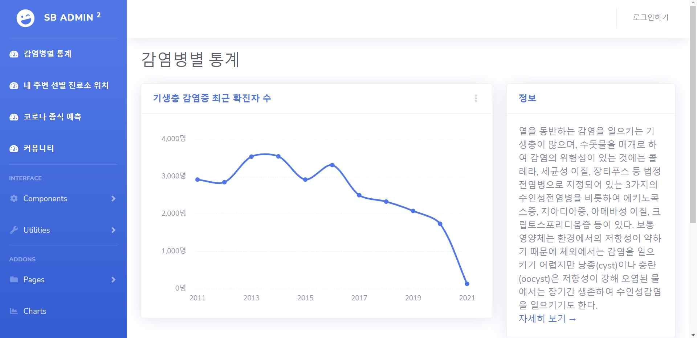
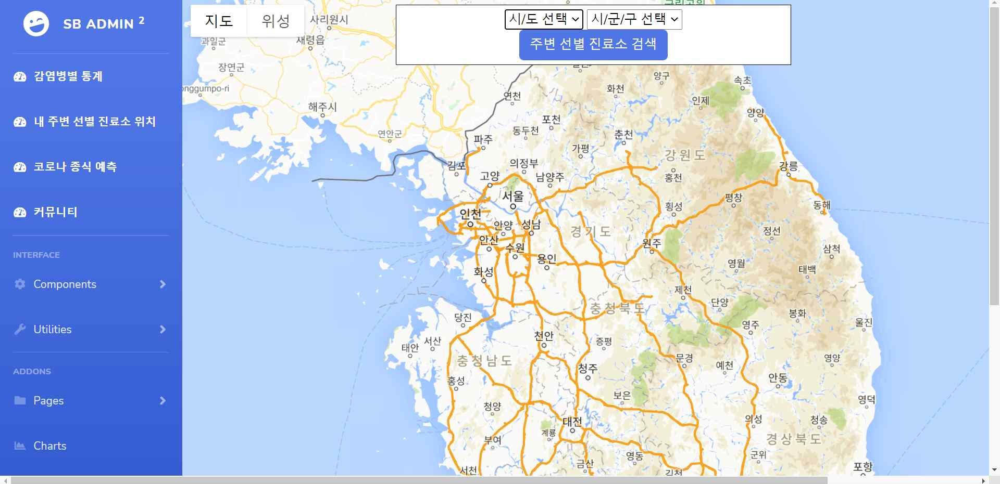
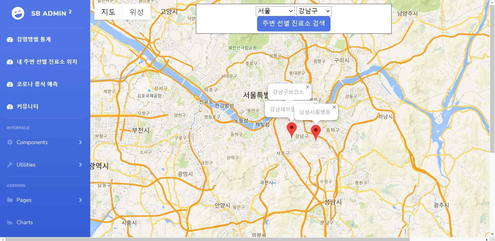
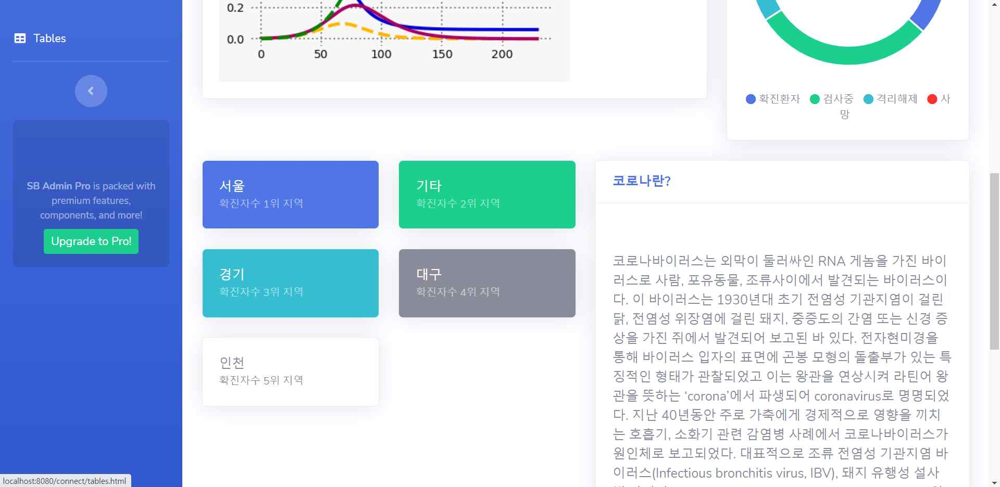
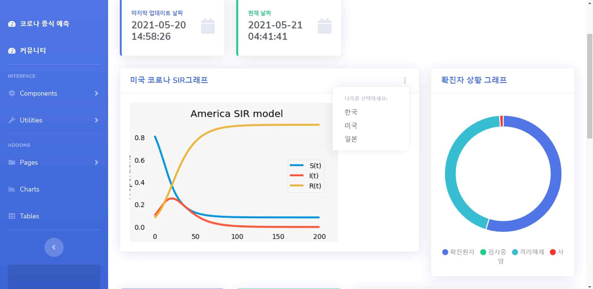
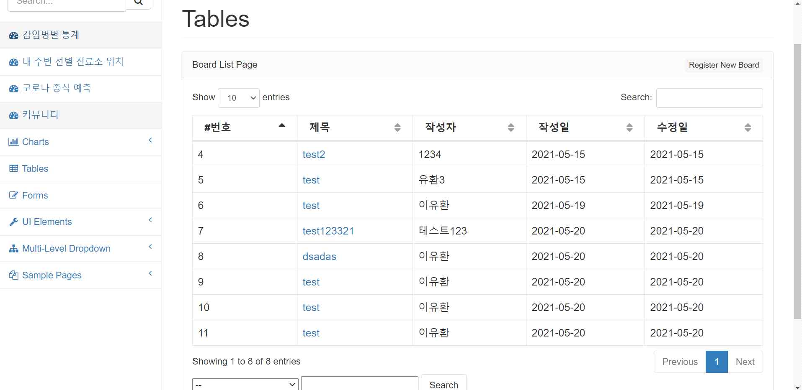
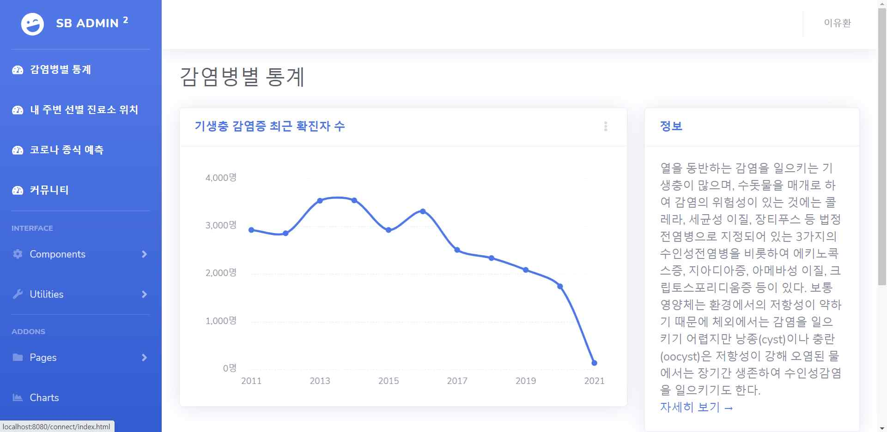

# DiseasePredictSpringWeb
1. 각 국가 통계 데이터를 기반 SEIR & SIR 모델을 이용해 코로나 종식 예측
2. 각 지역 별 선별 진료소를 표시 
3. 전례의 전염병들 통계 그래프 시각화

 

시연 영상
--------------------------

 
 

시스템 구성
--------------------------
  

 
 

프로젝트 이미지

 
  
감염병별 통계
--------------------------

공공 데이터 포털에서 가져온 각종 감염병 현황을 그래프로 표시하여 준다.
(보고 싶은 감염병 종류 선택)

 

 
  
내 주변 선별 진료소 위치
-------------------------

내 주변 선별 진료소 위치(검색 후)
-------------------------

구글맵 api를 이용한 선별 진료소 위치 검색

 
  
코로나 SIR & SEIR 모델
-------------------------

 

한국 코로나 공개 API를 이용해 데이터를 받아온 후 SEIR 모델로 분석 후 종식일 예측 차트를 띄워준다.
우측 상단 최신 정보로 업데이트를 클릭 시 Flask 서버에서 최신 데이터를 새롭게 분석하여 홈페이지 최신화를 시켜준다.

코로나 SIR 모델
-------------------------

한국, 미국, 일본 코로나 종식 예측 이 가능하며 미국, 일본 같은 경우 각 홈페이지에서 데이터 크롤링 후 SIR 모델을 이용하여 분석

 
  
커뮤니티
-------------------------

작성자 본인 여부 판단을 위해 게시글 작성 시 비밀번호를 입력하는 데 Bcrypt를 이용해 암호화하여 DB에 저장한다.

 
  
네이버 로그인 API를 이용한 로그인
-------------------------

우측 상단 로그인을 클릭 시 나오는 화면이다. 이것을 통해 네이버 아이디를 이용한 로그인이 가능하다.

 
  
로그인 결과
-------------------------

우측 상단에 해당 네이버 아이디에 등록되어 있는 이름이 정상적으로 출력 중인 것을 볼 수 있다.

